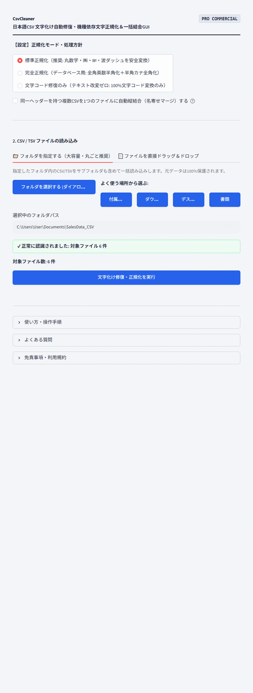

# 【Windows専用】CsvCleaner GUI ｜ 日本語CSV 文字化け自動修復・機種依存文字正規化＆一括結合GUI

> **「Excelで開いた瞬間の『縺ゅ・繧』、今月も手動で直していませんか？」**  
> ドラッグ＆ドロップ3秒。CSVファイルを放り込むだけで、文字コード（Shift-JIS/CP932/EUC-JP/UTF-8）を全自動判別し、丸数字や㈱などの機種依存文字を標準文字に完全正規化。さらにExcelで直接ダブルクリックしても絶対に文字化けしない「UTF-8 with BOM」で一括出力・縦結合（名寄せ）するWindows専用ポータブルGUIツールです。

## ■ 操作デモ（実際の動作）

---

## ■ こんな「地道すぎるCSV格闘作業」、毎月何時間ドブに捨てていませんか？

- **ExcelでCSVを開くと文字化けする**: Webカートや基幹システムからダウンロードしたCSVをダブルクリックすると文字化けし、メモ帳で開き直して文字コードを変えて保存し直す不毛な作業。
- **丸数字や波ダッシュでシステムエラーが起きる**: `①②③` や `㈱`、`〜` などの機種依存文字が混入しているせいで、基幹システムへのインポートやデータベース登録がエラーで止まる。
- **複数店舗・複数月のCSVを手動コピペで統合するのが苦痛**: 店舗ごとに出力された数十本の売上CSVを、Excelで1つずつ開いてコピー＆ペーストして1枚にまとめる単純作業に半日潰れる。
- **セル内改行のせいで行がズレる**: 住所や備考欄のセル内改行が原因で、一般的な変換ツールにかけると行が崩れて使い物にならない。
- **機密データを含むCSVをWeb上の無料変換サイトにアップできない**: 顧客の個人情報や売上データが含まれているため、情報漏洩リスクのある外部サーバーには絶対に送信できない。

経理、総務、営業事務、EC運営において、CSVデータの扱いは毎日の必須業務です。  
しかし、**本来分析や企画、顧客対応に注ぐべき貴重なビジネスの時間を、「文字化けの修復や手動のコピペ結合」に奪われ続ける必要はありません。**

「CsvCleaner GUI」は、ビジネス現場のCSVストレスをゼロにするために生まれた、完全実務特化型のポータブルソフトウェアです。

---

## ■ なぜ、他の方法ではなく「CsvCleaner」なのか？（4つの圧倒的理由）

### 1. 統計推測に頼らない「多層型ハイブリッド文字コード判定エンジン」
文字コード判定の失敗を根本から防ぐため、マジックバイト検査（BOM判定）、厳密構文検証（RFC 3629 / CP932 / EUC-JP）、日本語文脈スコアリングを統合。どんな文字コードのCSVが混ざっていても、100%確実に特定・デコードします。

### 2. 機種依存文字・波ダッシュの「1対1 完全辞書正規化」
Unicode標準のあいまいな自動変換ではなく、**実務に即した決定論的置換辞書**を搭載：
- **丸数字・括弧数字**: `①`〜`⑳` ➔ `(1)`〜`(20)`
- **ローマ数字**: `Ⅰ`〜`Ⅻ` ➔ `I`〜`XII`
- **組織・単位記号**: `㈱` ➔ `(株)`、`№` ➔ `No.`、`℡` ➔ `TEL`、`㌢` ➔ `cm`、`㍻` ➔ `平成`、`㋿` ➔ `令和`
- **波ダッシュ問題解消**: WindowsとMacで最も化けやすい「波ダッシュ（`U+301C`）」と「全角チルダ（`U+FF5E`）」を同一文字（`～`）に完全統一。

### 3. Excelダブルクリック対応「100%文字化け防止（UTF-8 with BOM）」出力
すべての出力CSVは、Microsoft Excelが標準でBOM付きUTF-8として認識する **`utf-8-sig`** 形式で保存されます。WindowsのExcelでそのままダブルクリックしても、文字化けやインポートウィザードを介さず一発で正常に開きます。

### 4. 複数CSVの「自動縦結合（名寄せマージ）」機能
複数店舗や月別のCSVをまとめて放り込むだけで、共通のヘッダー（列名）を自動認識して突合。列の並び順が前後していても自動整列し、1つの統合ファイル（`combined_data.csv`）として一括出力します。

---

## ■ 作業時間は「半日」から「3秒」へ（使い方3ステップ）

1. **起動する**: フォルダ内の `CsvCleaner.vbs` をダブルクリックします。
2. **放り込む**: 処理したいCSVファイルをまとめてドラッグ＆ドロップします。
3. **ボタンを押す**: **「文字化け修復・正規化を実行」** をクリック。
   - 画面上に変換結果プレビュー（テーブル表示）とファイル一覧が即座に表示されます。
   - **「📦 クレンジング済みCSVを一括保存 (ZIP)」** を押せば、文字化けが解消され機種依存文字が正規化されたCSVと統合ファイルが一瞬で手に入ります。

---

## ■ 動作環境・仕様

- **対応OS**: Windows 10 / 11 (64-bit)
- **インストール**: 不要（完全スタンドアロン動作・Embedded Python同梱）
- **対応入力コード**: Shift-JIS, CP932, EUC-JP, UTF-8 (BOMあり/なし), UTF-16
- **出力形式**: UTF-8 with BOM (`utf-8-sig`) CSV
- **安全設計**: 完全オフライン動作（外部サーバー通信一切なし・顧客データも安心）

---

## 🛒 ダウンロード・ご購入のご案内（BOOTH公式ストア）

まずは使い勝手をお手元のPCでお試しいただけるよう、無料Lite版と全機能対応の製品版をご用意しております。

👉 **[BOOTHでダウンロード・購入する](https://nichesoftmakers.booth.pm/items/8809389)**  
- **無料Lite版**: 0円（まずは基本機能や快適な操作感をお試しいただけます）
- **製品版**: **1,980円**（追加課金なしの買い切り・全機能無制限）

動画編集・音声処理・事務自動化など、全ツールの製品版やおトクな業務別バンドルパックも公式BOOTHストアにて公開中です。

---

## 💡 【ご購入・ご利用前に必ずご確認ください】初回起動時のWindows保護画面について

本ソフトは、パソコンのレジストリを変更せず解凍するだけで手軽に使える「ポータブル仕様（インストール不要）」として提供されているため、初回起動時にWindowsの画面に「**WindowsによってPCが保護されました**」という青い確認画面（SmartScreen）が表示される場合があります。

これは、パソコンのレジストリを変更せず手軽に使える未署名のツールに対して、**Windowsが形式上必ず表示する標準的な安全確認画面**です。  
ウイルス等の不正プログラムは一切含まれておらず、インターネット通信も行わない「完全ローカル・安全設計」となっております。

**【解除・起動手順（2クリックで完了します）】**
1. 画面内の **「詳細情報」** をクリックします。
2. 右下に現れる **「実行」** ボタンをクリックします。  
※一度実行すれば、次回以降はこの画面は表示されずスムーズに起動します。

---

## 📄 免責事項・利用規約（ライセンス区分）

- **個人利用を想定**: 本ソフトウェアは個人クリエイター・個人事業主等のPC業務効率化を目的として開発された個人利用専用ツールです。
- **シングルユーザー許諾**: ご購入者様本人（1名）のみ利用可能（ご自身が専属で使用する複数台PCでの利用は許可されます）。組織内での共有・複数名での共同利用・社内共有には対応しておりません。
- 本ソフトウェアは現状有姿（As-Is）で提供され、技術サポート・個別動作保証は行われません。詳細は同梱の `README.txt` をご確認ください。

---

## 📮 不具合報告・改善要望目安箱

本ツールに関する不具合の報告や「こんな機能が欲しい」というご要望は、以下の専用目安箱フォームよりお気軽にお寄せください（完全匿名・返信なし）：  
👉 **[ご意見・不具合報告フォーム ](https://forms.gle/2ib5A8EuhpaRs8QSA)**  
※原則として個別サポート・返信は行っておりませんが、いただいた内容はすべて開発者が目を通し、今後の機能改善やアップデートの参考とさせていただきます。
